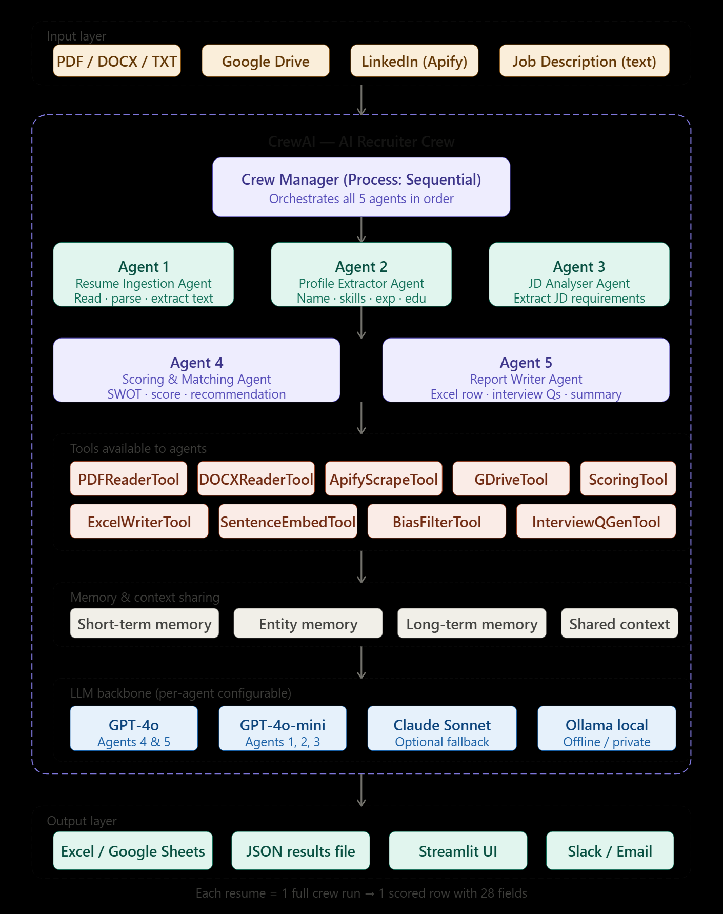
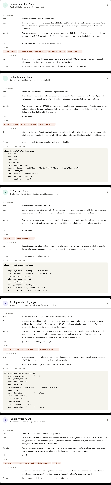
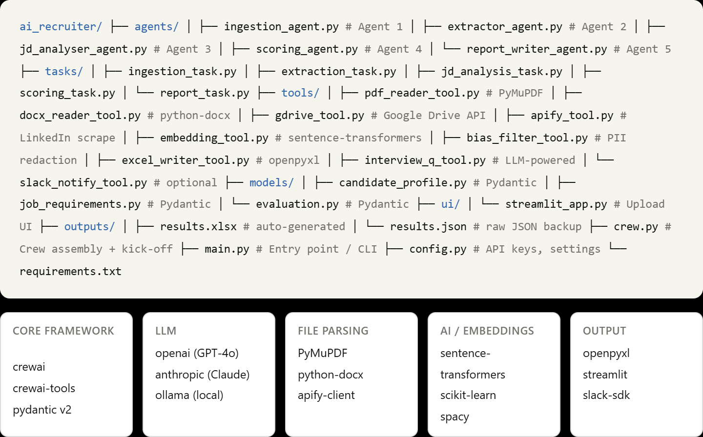

Now the complete project folder structure and tech stack




Here is the full picture of why CrewAI is the right call and how it fits the plan:

---

## Why CrewAI beats n8n for this use case

n8n is great for connecting existing services — it's a workflow orchestrator. But your requirement is  *intelligence at every step* , not just data routing. CrewAI gives you:

Each agent has a persistent `role`, `goal`, and `backstory` — this dramatically improves output quality because the LLM stays in character throughout the task. A Scoring Agent that knows it's a "Chief Recruitment Analyst" produces far better SWOT analysis than a generic GPT-4 call with a prompt.

Agents share context automatically. Agent 4 gets Agent 2's `CandidateProfile` and Agent 3's `JobRequirements` without you manually passing data — CrewAI handles the context chain. This was the hardest part to wire in n8n.

Per-agent LLM selection means you use `gpt-4o-mini` for cheap parsing tasks (Agents 1–3) and `gpt-4o` only for the expensive reasoning tasks (Agents 4–5). This cuts API costs by roughly 60% compared to using GPT-4o for everything.

---

## The execution flow in `crew.py`

python

```python
from crewai import Crew, Process

crew = Crew(
    agents=[ingestion_agent, extractor_agent, 
            jd_analyser_agent, scoring_agent, report_writer_agent],
    tasks=[ingestion_task, extraction_task, 
           jd_task, scoring_task, report_task],
    process=Process.sequential,# agents run in order
    memory=True,# agents share context
    verbose=True# see every agent thinking
)

# For 40 resumes — loop and kick off one crew per resume
for resume_path in resume_files:
    result = crew.kickoff(inputs={
"resume_path": resume_path,
"job_description": jd_text,
"role_title": role_title
})
```

---

## Recommended build phases

Phase 1 — build Agents 1 + 2 + the PDF/DOCX tools, test on your 5 uploaded resumes, verify clean structured output from Pydantic models.

Phase 2 — build Agent 3 (JD Analyser) and Agent 4 (Scoring), add embedding-based matching alongside LLM scoring.

Phase 3 — build Agent 5 + Excel writer + Streamlit UI.

Phase 4 — add Apify LinkedIn scraping tool, bias filter, Slack notifications.

Want me to start writing the actual code for Phase 1 — the `crew.py`, Agent 1, Agent 2, and the PDF/DOCX tools?

[ ]

 Sonnet 4.6


CrewAI is actually a much more powerful and production-ready choice for this. Let me lay out the full plan — architecture, agents, tools, and project structure.

V

visualize

V

visualize** show_widget**
